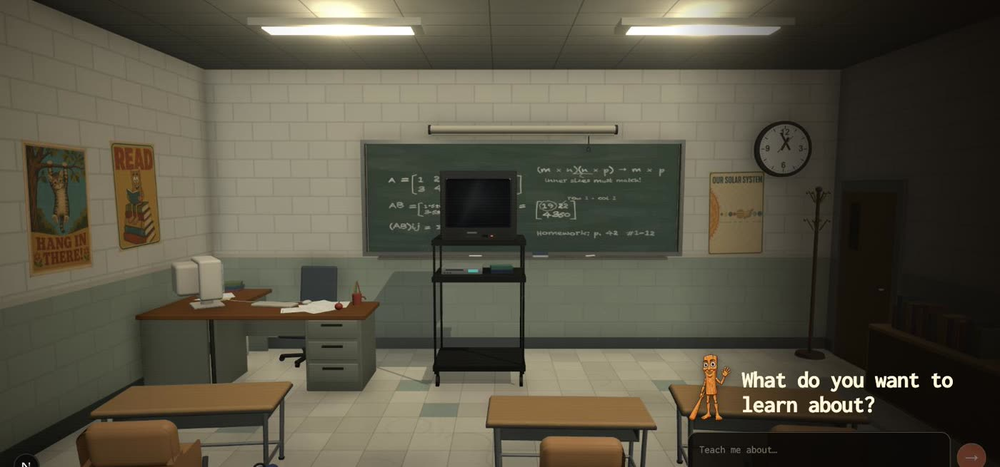

# Canal Megafón

A TV channel that teaches marketing. Type any topic, an LLM plans a one-minute lesson as twelve
five-second beats, MiniMax H3 Max Turbo renders each beat as a 1970s-style educational cartoon just
before it airs, and the clips play on a CRT inside a 3D classroom with a program guide for queueing
what's next. **The lessons are taught in Castilian Spanish**; every prompt sent to fal stays in
English, because H3's prompt rewriter reasons in English — only the line the teacher says out loud is
Spanish, and the prompt says so explicitly.


*(screenshot taken before the marketing rebrand)*

The teacher is Megafón, a cartoon megaphone. He lives in exactly two places, so swapping in your own
teacher is a two-file change: edit the `TEACHER` object in `src/lib/classroom-config.ts` (name, show
name, voice, and the numbered character sheet — keep it as short numbered lines; fal's prompt
rewriter copies lists verbatim but compresses prose) and replace the sprite at
`public/teacher-standing.png` (`scripts/generate-teacher-sprite.mjs` redraws one from the character
sheet, or from a reference image if you pass one).

What makes it a marketing channel rather than a general one lives in two places too: the planner
brief in `src/server/lesson-producer.ts` (the curriculum rules — real frameworks, no invented
benchmarks, no growth hacks, something applicable at the end of every beat) and
`LOBBY_TOPIC_PICKS` in `src/lib/classroom-config.ts` (the four suggestions on the lobby screen,
which fill the box but never start a lesson on their own).

## Run it

Requirements: Node 22.6+ (`.nvmrc`), a [fal.ai](https://fal.ai) key, and ideally a Gemini key.

```bash
npm install
cp .env.example .env.local   # then fill in FAL_KEY (required) and GEMINI_API_KEY (recommended)
npm run dev                  # http://localhost:3000
```

Type a topic, press enter, and the TV tunes in. **Every lesson costs real money** — see below —
so the app never starts a lesson without you sending one yourself.

### Keys

| Key | Used for | Required |
|---|---|---|
| `FAL_KEY` | H3 Max video rendering (all clips) | yes |
| `GEMINI_API_KEY` | Lesson planning (~4.5 s per lesson with `gemini-3.1-flash-lite`) | recommended |
| `OPENROUTER_API_KEY`, `ANTHROPIC_API_KEY`, `OPENAI_API_KEY` | Planning fallbacks, tried in that order after Gemini; fal's own LLM router is the last resort | no |
| `OPENAI_API_KEY` | Also renders the "Thanks for watching" end card with `gpt-image-2` | no |
| `OPENAI_BASE_URL` | Points the OpenAI planner route at any OpenAI-compatible server — OpenRouter, Groq, a proxy, or a local model via Ollama / LM Studio | no |

Per-provider model overrides live in `.env.example`. Planning always uses the first configured
provider from the top; video always uses fal.

### What a lesson costs

One lesson is one lesson-planning call (about a cent) plus **twelve five-second clips rendered at
480p** — multiply fal's current per-second 480p rate on the
[H3 Max Turbo pricing page](https://fal.ai/models/minimax/h3-max-turbo/text-to-video) by 60 seconds
for the cost of a lesson. fal's billing is the source of truth. Failed renders are not billed and are
retried once. `CLASSROOM_CONFIG.localCeilingCents` in `src/lib/classroom-config.ts`
caps what one session may spend.

`SAVE_RECORDINGS=1` (the default) writes every rendered clip, its prompt, and fal's rewritten prompt
to `recordings/<sessionId>/` so nothing is lost when the dev server restarts. The folder is
git-ignored.

## How it works

```
topic ──► planner (Gemini) ──► 12 beats ──► H3 Max Turbo, just in time ──► runway ──► CRT in the classroom
                                                 ▲                                    │
                                                 └──── program guide queues the next lesson ◄──┘
```

- **Planning** (`src/server/lesson-producer.ts`) makes one LLM call that writes narration and a
  visual beat for all twelve scenes. There is no per-scene LLM call.
- **Rendering** (`src/server/fal.ts`, `classroom-runtime.ts`) keeps a small runway of clips ahead
  of playback: two clips must be decoded before the lesson starts, then production stays two to
  four scenes ahead and recovers toward six after an underrun. Two renders run concurrently.
- **Prompts** (`src/lib/classroom-config.ts`) are written for fal's prompt rewriter, not the video
  model: H3 Max always paraphrases the prompt before rendering, and long prose descriptions lose
  details every scene. The teacher is therefore an eleven-line numbered character sheet the
  rewriter copies verbatim. `compileH3ScenePrompt` assembles sheet + scene + voice + style, and
  pins the spoken line to Castilian Spanish so the rewrite cannot dub it into English.
- **Language split**: the planner writes `narration`, `title`, `concept` and the follow-up
  suggestions in Spanish, but `visualAction` in English — that field is a video prompt nobody reads
  aloud, and H3 follows English staging far more reliably.
- **Playback** (`src/components/lesson-deck.tsx`) assigns fal's CDN URLs straight to reusable
  `<video>` elements, holds the first frame until it is painted, and layers the tuning static,
  colour bars, and sign-off card on top. One soundtrack loops continuously across lessons.
- **Playlist** (`classroom-playlist-runtime.ts`) runs queued lessons as child sessions that share
  one playback runway, so the next lesson is already rendering while the current one airs. If
  nothing is queued, the sign-off card auto-advances to the first suggested follow-up after ten
  seconds.
- **The set** (`src/components/set/`) is hand-built with react-three-fiber: procedural textures,
  furniture, the CRT and AV cart, and set dressing.
- **Phones** get a different shape, not a shrunken one. The guide docks to the bottom as a sheet that
  starts collapsed to a now-playing bar (the CRT is what a phone screen is for) and opens on tap;
  held sideways it goes back to the side, narrow and compact. Both scroll as a single surface —
  nested scrollers fight each other under a thumb — and pad themselves with the safe-area insets.
  The scene also drops screen-space ambient occlusion and caps the pixel ratio below 700px wide or
  540px tall, since a phone is decoding video at the same time.

## Deploying

There is no database, queue, or separate worker process — the lesson runtime is an in-memory
singleton inside the Next.js server, and fal is called over HTTPS. That means it runs anywhere a
single long-lived Node process runs (`npm run dev`, or `npm run build && npm start` on a VM,
Fly, Railway, etc.) and it does **not** work on serverless platforms: on Vercel-style deployments
each invocation gets a fresh process, so sessions and in-flight renders evaporate between requests.
Recordings also write to the local filesystem. One process, one disk.

## Prompt debugging

The single most useful thing to know: look at what fal *actually* rendered from, not what you sent.

```bash
node scripts/expanded-prompts.mjs <sessionId>               # rewritten prompt per scene + which
                                                            # character-sheet lines survived
node --experimental-strip-types scripts/probe-h3-expansion.mjs ["beat"] ["line"]
                                                            # render ONE clip (paid) with the current
                                                            # prompt and print its expansion
node scripts/probe-planner-narration.mjs "topic"            # run the planner (~1¢), flag narration
                                                            # that breaks character or drifts into English
node scripts/bench-planner.mjs                              # planner latency across providers
```

Session ids appear in the dev-server log; `recordings/<sessionId>/scene-NN.json` holds the same
data for finished lessons.

## Scripts

| Command | What it does |
|---|---|
| `npm run dev` / `build` / `start` | Next.js app |
| `npm run typecheck`, `lint`, `test` | Static gates CI runs |
| `npm run verify` | No-spend smoke test against a production build (run `npm run build` first) |
| `npm run soundtrack` | Regenerates the classroom loop in `public/audio/` |
| `node --experimental-strip-types scripts/generate-teacher-sprite.mjs [reference] [flatten]` | Redraws the teacher sprite from the character sheet, or from a reference image (OpenAI Images) |
| `node scripts/generate-posters.mjs` | Regenerates the classroom posters (OpenAI Images) |

## Layout

```
src/app/                 Next.js routes (page, /api/classroom, /api/signoff-image)
src/components/          classroom.tsx (lobby + program guide), lesson-deck.tsx (the TV), set/ (3D)
src/hooks/               polling client, continuous soundtrack
src/lib/                 config + prompts, types, boundary parsing
src/server/              planner, fal client, lesson runtime, playlist runtime, archiving
scripts/                 generators and prompt-debugging probes
```

## Assets to regenerate

The sprite and the classroom posters still hold the artwork of the channel's previous teacher. They
render fine, they just show the wrong character; one OpenAI Images call each replaces them:

```bash
node --experimental-strip-types scripts/generate-teacher-sprite.mjs   # public/teacher-standing.png
node scripts/generate-posters.mjs                                     # public/posters/*.png
```

## License

MIT.
